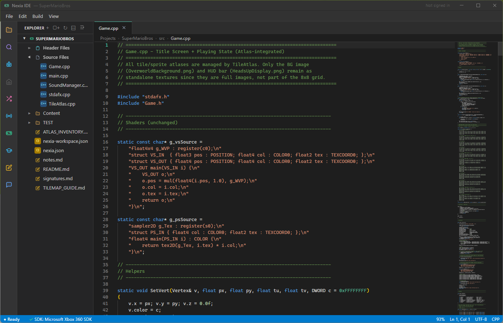

<p align="center">
  
</p>

<h1 align="center">Nexia IDE</h1>

<p align="center">
  <strong>A standalone development environment for Xbox 360 homebrew.</strong><br>
  No Visual Studio required — just install and start building.
</p>

<p align="center">
  <a href="#features">Features</a> •
  <a href="#getting-started">Getting Started</a> •
  <a href="#building-from-source">Build from Source</a> •
  <a href="#architecture">Architecture</a> •
  <a href="#keyboard-shortcuts">Shortcuts</a> •
  <a href="#license">License</a>
</p>

---

<p align="center">
  
</p>

## Features

**Code Editor** — Full Monaco-based editor with Xbox 360 C++ syntax highlighting, IntelliSense, tab management, and a Visual Studio–style Solution Explorer for navigating your project.

**One-Click Build System** — Compile, link, and package `.xex` executables directly from the IDE. Supports Debug, Release, and Profile configurations with real-time build output.

**SDK Tools** — Integrated access to shader compiler (fxc), audio encoder (xma2encode), XUI compiler, binary inspector, PIX profiler launcher, and more — all without leaving the IDE.

**Devkit Management** — Connect to a development kit over the network. Deploy builds, reboot the console, capture screenshots, browse the file system, and monitor CPU/memory usage.

**Emulator Integration (Nexia 360)** — Launch and debug your builds in an emulator. Set breakpoints, inspect registers, step through code, read/write memory, and view backtraces.

**Project Templates** — Start from an empty project, a spinning textured cube demo, a XUI application, or an XBLA title scaffold complete with networking and achievements setup.

**Extensions** — Install community tools, templates, snippet packs, themes, and plugins from `.zip` files or folders. Create and share your own.

**Discord Community** — Built-in Discord feed to browse threads, post questions, and share downloads without leaving the IDE.

**Learning System** — Guided onboarding, interactive tutorials, quizzes, flashcards, study notes, achievements, and a code-along helper to learn Xbox 360 development as you go.

**Git Integration** — Initialize repos, stage changes, commit, and view status from the sidebar.

**Find in Files** — Search across your entire project with `Ctrl+Shift+F`.

**Project Export / Import** — Package your project as a `.zip` archive or import one to get started quickly.

## Getting Started

### Requirements

- **Windows 10 or 11**
- **Microsoft Xbox 360 SDK (XDK)** installed
- An Xbox 360 development kit *(optional — the emulator works without one)*

### Install

Download the latest release from the [Releases](../../releases) page. Choose between the installer (`.exe`) or the portable build.

On first launch, the setup wizard will detect your SDK installation and walk you through configuration.

## Building from Source

```bash
# Install dependencies
npm install

# Build and run
npm start
```

### Distribution Builds

```bash
# Portable directory build
npm run dist

# NSIS installer
npm run dist:installer
```

Output goes to the `dist/` folder.

## Architecture

```
├── main.ts              # Electron main process — window, IPC handlers
├── app.ts               # Renderer — UI logic, Monaco, all panels
├── index.html           # Main UI shell
├── main.css             # Dark theme (Xbox green)
├── types.ts             # Shared TypeScript interfaces & IPC channels
├── toolchain.ts         # SDK detection & tool path resolution
├── buildSystem.ts       # Compiler, linker, XEX packaging pipeline
├── projectManager.ts    # Project templates, create/open/save
├── devkit.ts            # Development kit connection & management
├── emulator.ts          # Emulator launch, debug, breakpoints
├── sdkTools.ts          # Shader, audio, XUI, binary tool wrappers
├── extensions.ts        # Extension install/uninstall/enable
├── discord.ts           # Discord feed integration
├── learning.ts          # Tutorials, achievements, code-along
└── quizzes.ts           # Quiz & flashcard content
```

The app is built with **Electron 28**, **TypeScript 5**, and **Monaco Editor**. The main process handles all filesystem, SDK, and network operations; the renderer is a single-page UI that communicates over IPC.

## Keyboard Shortcuts

| Shortcut | Action |
|---|---|
| `F5` | Build |
| `F6` | Run in emulator |
| `Ctrl+S` | Save |
| `Ctrl+Shift+B` | Rebuild |
| `Ctrl+N` | New Project |
| `Ctrl+O` | Open Project |
| `Ctrl+W` | Close Tab |
| `Ctrl+G` | Go to Line |
| `Ctrl+Shift+F` | Find in Files |
| `Escape` | Close Dialogs |

## License

[MIT](LICENSE) — Copyright © 2026 Nexia
